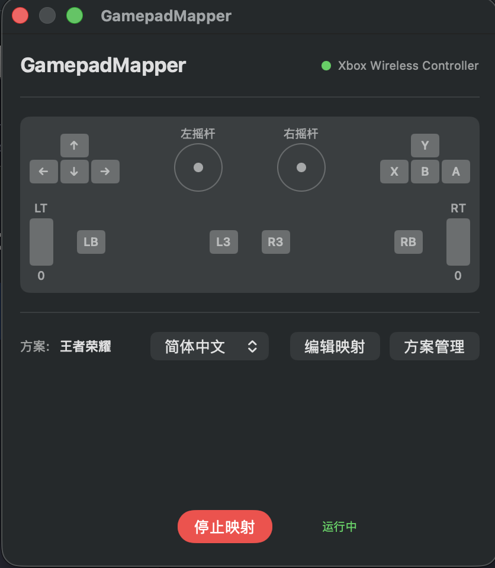

# GamepadMapper — 한국어

**GamepadMapper** 는 게임패드 버튼과 아날로그 스틱을 키보드 키 및 마우스 동작으로 실시간 매핑하는 macOS 메뉴 표시줄 앱입니다.

<p align="center">
  
</p>

## 주요 기능

- 게임패드 버튼을 키보드 키, 마우스 버튼, 마우스 이동으로 매핑
- HID 수준 입력으로 백그라운드에서도 안정적으로 동작
- 다중 프로필 지원 — 매핑 구성 간 즉시 전환
- 프로필별 감도 및 데드존 설정
- 다국어 UI: 영어, 중국어(간체), 일본어, 한국어, 러시아어, 스페인어
- 실시간 컨트롤러 상태 시각화
- 디버그 로그

## 시스템 요구 사항

- macOS 14(Sonoma) 이상
- Apple Silicon(M1+) 또는 Intel Mac

## 빌드

```bash
git clone https://github.com/huangyebiaoke/GamepadMapper.git
cd GamepadMapper
swift build
```

## 사용법

1. 앱 실행 — 메뉴 표시줄에 게임패드 아이콘이 표시됩니다
2. Bluetooth 또는 USB로 컨트롤러 연결
3. 메뉴 표시줄에서 설정을 열고 **매핑 시작** 클릭
4. 매핑을 편집하여 버튼 할당 사용자 지정
5. 다른 앱으로 전환 — 매핑은 백그라운드에서 계속 작동합니다

---

[← README로 돌아가기](../README.md) · [라이선스](../LICENSE)
